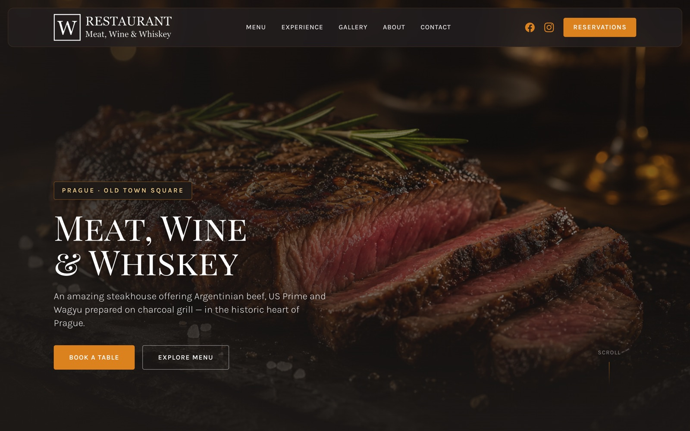
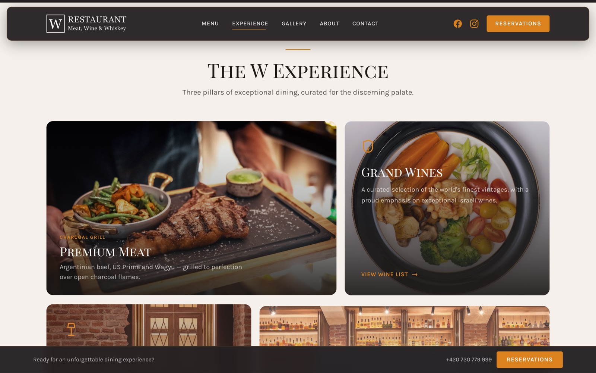
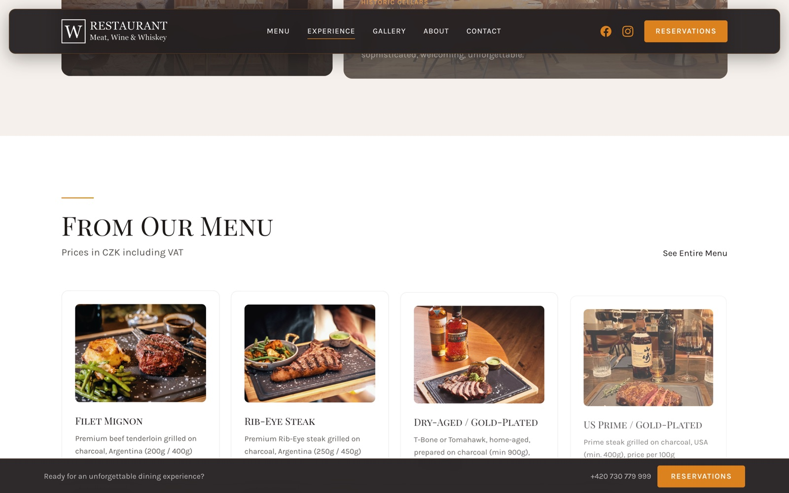
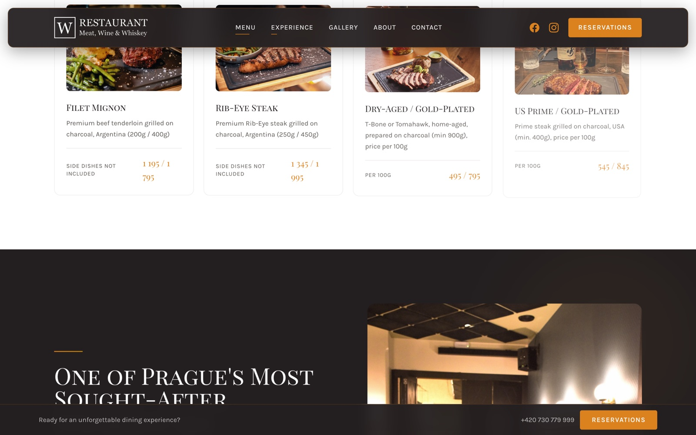
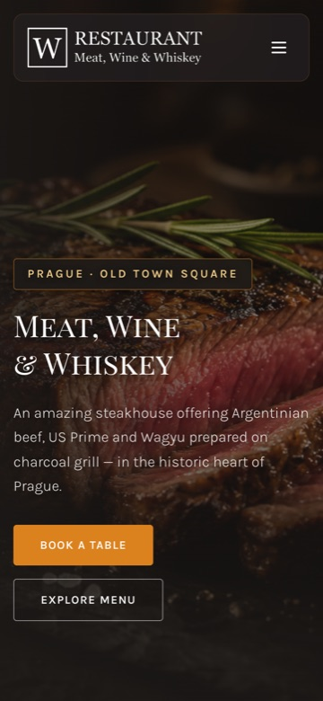

# W Steak Restaurant — Concept Landing Page

> **Unofficial redesign concept.** This project is not affiliated with, endorsed by, or maintained by [W Steak Restaurant](https://wrestaurant.cz/) (W Restaurant & Whiskey Bar, Prague).

A modern UI/UX concept for the landing page of **W Steak Restaurant — Meat, Wine & Whiskey**, created as a portfolio / design exploration piece.

[](https://zirvey.github.io/w-steak-restaurant-landing-page/)
[](LICENSE)



---

## Preview

### Desktop

| Hero | Experience |
|:---:|:---:|
|  |  |

| Menu highlights | About section |
|:---:|:---:|
|  |  |

### Mobile



---

## About this project

This repository contains a **non-production, unofficial** front-end concept that reimagines the public landing experience for [wrestaurant.cz](https://wrestaurant.cz/).

| | |
|---|---|
| **Purpose** | UI/UX redesign study & portfolio showcase |
| **Status** | Concept / demo only |
| **Official website** | [wrestaurant.cz](https://wrestaurant.cz/) |
| **Reservations** | [wrestaurant.cz/book-a-table](https://wrestaurant.cz/book-a-table) |

Content (copy, menu prices, imagery, logo) is sourced from the official website for demonstration purposes. All restaurant branding and trademarks belong to their respective owners.

---

## Features

- **Premium dark & gold** visual language aligned with the restaurant brand
- **Glassmorphism** navigation with scroll-aware states
- **Hero** with entrance animations and subtle parallax
- **Bento grid** for Meat · Wine · Whiskey · Ambience
- **Menu highlights** with pricing from the official menu
- **Scroll-triggered animations** with staggered reveals
- **Animated statistics** counters
- **Fully responsive** layout (mobile → desktop)
- **`prefers-reduced-motion`** support for accessibility

### Design system

Built with guidance from the [UI UX Pro Max](https://github.com/) design workflow:

- **Typography:** Playfair Display SC + Karla
- **Palette:** `#231F20` · `#DB821F` · `#FAFAF9`
- **Pattern:** Bento grid + liquid glass effects

See [`design-system/w-steak-restaurant/MASTER.md`](design-system/w-steak-restaurant/MASTER.md) for full design tokens.

---

## Quick start

No build step required — static HTML, CSS, and vanilla JavaScript.

```bash
# Clone
git clone https://github.com/Zirvey/w-steak-restaurant-landing-page.git
cd w-steak-restaurant-landing-page

# Serve locally
python3 -m http.server 8080
# → http://localhost:8080
```

Or open `index.html` directly in a browser.

### Regenerate screenshots

```bash
python3 -m http.server 8080 &
npm install puppeteer --no-save
npm run screenshots
```

---

## Project structure

```
├── index.html              # Main landing page
├── css/styles.css          # Custom styles & animations
├── js/main.js              # Scroll reveals, counters, interactions
├── assets/
│   ├── logo.png            # Official W Restaurant logo (third-party)
│   ├── favicon.ico
│   └── images/             # Photography from wrestaurant.cz
├── design-system/          # Persisted design system (UI UX Pro Max)
├── docs/screenshots/       # README preview images
├── scripts/capture-screenshots.mjs
├── LICENSE                 # MIT — code in this repo
├── NOTICE.md               # Third-party assets & trademarks
└── DISCLAIMER.md           # Unofficial concept notice
```

---

## Deployment

### GitHub Pages

1. Go to **Settings → Pages**
2. Source: **Deploy from branch**
3. Branch: `main` / root (`/`)
4. Save — site will be available at `https://zirvey.github.io/w-steak-restaurant-landing-page/`

### Any static host

Upload the repository root to Netlify, Vercel, Cloudflare Pages, or any static file server.

---

## Disclaimer

This is a **personal design concept**. It must not be presented as the official website of W Steak Restaurant. For real bookings, menu, and events always use [wrestaurant.cz](https://wrestaurant.cz/).

See [DISCLAIMER.md](DISCLAIMER.md) for the full legal notice.

---

## Third-party content

Logo, photography, menu data, and brand elements are property of W Steak Restaurant / wrestaurant.cz. See [NOTICE.md](NOTICE.md).

---

## Author

**Zirvey**

---

## Presentation

PDF-prezentace pro majitele provozovny (česky, 8 snímků):

📄 [`docs/W-Steak-Restaurant-Redesign-Proposal.pdf`](docs/W-Steak-Restaurant-Redesign-Proposal.pdf)

Пересобрать:

```bash
npm install puppeteer --no-save
npm run pdf
```

---

## License

Source code in this repository is licensed under the [MIT License](LICENSE).

Third-party brand assets and content are **not** covered by this license. See [NOTICE.md](NOTICE.md).
